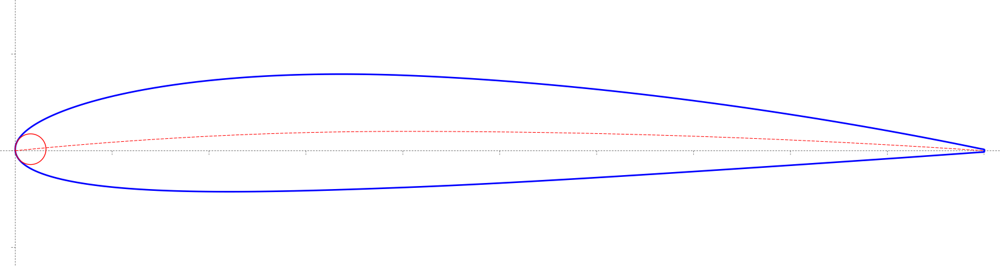
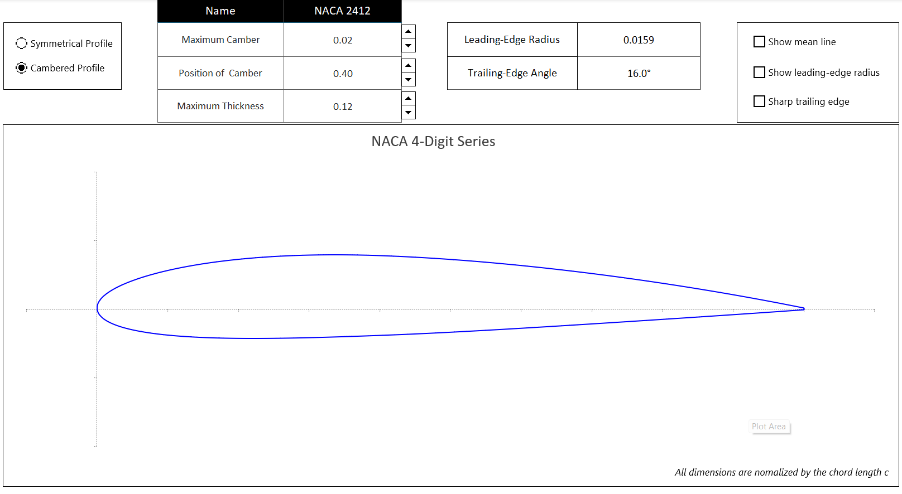
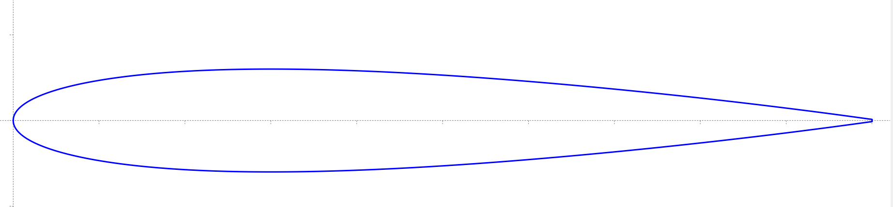
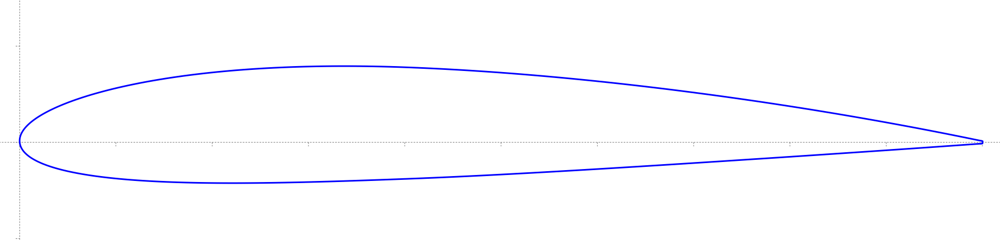
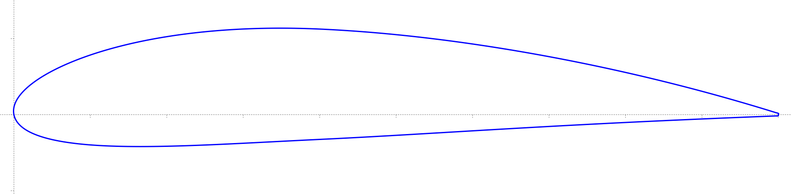

# NACA Airfoil Simulation


<p align="center">

</p>

<p align="center">
*Example airfoil geometry generated from the Excel simulation model* 
</p>

## Overview
This repository presents a geometric study of classical NACA airfoil families and an interactive simulation tool developed in Excel to visualize airfoil profiles. The project focuses on understanding the mathematical formulation and geometric characteristics of NACA airfoils and generating their corresponding shapes through parametric control.
The simulation allows users to explore how defining parameters influence the airfoil geometry and provides graphical visualization of the resulting profiles.

## Project Objectives
- Introduce the mathematical formulation of classical NACA airfoils
- Simulate airfoil geometry using a parametric Excel-based model
- Visualize upper and lower surfaces of airfoil profiles
- Analyze the influence of geometric parameters on airfoil shape
- Provide clear graphical representations of generated airfoils

## Features of the Simulation Tool
The Excel-based simulation tool includes:
- Interactive parameter control for defining airfoil geometry
- Visualization of the upper and lower camber lines
- Display of the mean camber line
- Representation of the leading-edge curvature
- Automatic update of airfoil geometry when parameters are modified
The model enables intuitive exploration of how NACA parameters affect the resulting airfoil shape.

## Repository Structure
```text
NACA-Airfoil-Simulation/
│
├── excel_model/          # Excel-based airfoil simulation tool
│
├── profile_figures/      # Generated airfoil profile visualizations
│   ├── grid/             # Figures with coordinate grid
│   └── plain/            # Clean figures without grid
│
├── profile_data/         # Airfoil coordinate datasets (.dat)
│
├── readme_figures/       # Illustrations used in the README
│
├── report/               # LaTeX source files of the report
│   ├── sections/         # Individual report sections
│   └── figures/          # Figures used in the report
│   
├── report.pdf            # Final compiled project report
└── README.md             # Project documentation
```
## Methodology
The airfoil geometries are generated using classical analytical expressions for NACA profiles. These formulas define the thickness distribution and camber line, which are then combined to construct the upper and lower surfaces of the airfoil.
The Excel model computes the coordinates and visualizes the airfoil geometry through dynamic charts.

## Using the Excel Simulation Tool
This project includes an Excel-based interactive model that allows users to generate and visualize classical NACA airfoil geometries.

### Simulation File
The simulation model can be found in:
excel_model/airfoil_simulation.xlsx

### Steps to Use the Tool
1. Open the Excel simulation file ‘naca_airfoil_simulation.xlsx’ on Microsoft Excel.
2. Choose NACA airfoil family.
3. Modify the NACA airfoil parameters.
4. The chart updates dynamically to display the airfoil geometry.

### Airfoil Parameters
| Symbol | Description |
|---|---|
| m | Maximum camber |
| p | Position of maximum camber |
| t | Maximum thickness |
| $C_{l_i}$ | Design lift coefficient |
| I | Leading edge radius index |
| $x_t$ | Position of maximum thickness |

### Supported Airfoil Families
| Airfoil families | Parameters |
|---|---|
| NACA 4-digit | m, p, t |
| NACA 5-digit | $C_{l_i}$, p, t |
| NACA 4-digit modified | m, p, t, I, $x_t$ |
| NACA 5-digit modified | $C_{l_i}$, p, t, I, $x_t$ |
| NACA 16-series | $C_{l_i}$, t |

### Output
The tool generates airfoil coordinates and visualizes the airfoil profile through dynamic charts. 

#### Additional geometric measurements 
- Leading edge radius
- Trailing edge angle

#### Additional display options
- Show mean line
- Show leading edge radius
- Sharp trailing edge 

### Example interface


### Example Generated Airfoils
|---|---|---|
|  |  |  |
| NACA 0012 | NACA 2412 | NACA 4415 |

## Applications
This project is intended for educational and exploratory purposes in:
- Aerodynamics fundamentals
- Airfoil geometry analysis
- Introductory aerospace engineering studies

## Possible Extensions
Future improvements of this project may include:
- Implementation of additional NACA series (6-series and 6A-series)
- Automated coordinate export for aerodynamic analysis
- Integration with aerodynamic tools for lift and drag estimation
- Development of a Python-based interactive visualization tool

## Author
**Nghia Tran**
Physics student with interests in aerospace engineering, aerodynamics, and aircraft design.
Github: https://github.com/trungnghiatranaero

## License
This project is intended for academic and educational purposes.
